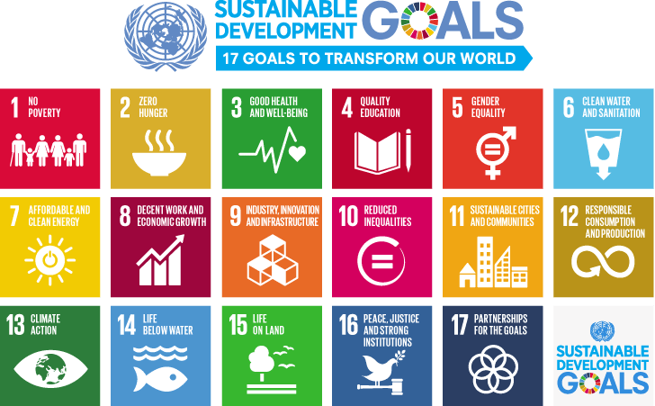

```{r}
library(dplyr) # transformasi data
library(tidyr)

library(ggplot2) # visualisasi
library(ggpubr) # untuk exporting plot
library(plotly) # plot menjadi interaktif

library(scales) # untuk tampilan digit (memberikan koma dll)
library(glue)
library(lubridate) # working with datetime
library(reshape2) # for melt function

#world map
library(sf)
library(rnaturalearth)
library(countrycode)
theme_set(theme_classic())
```

https://www.kaggle.com/datasets/sazidthe1/sustainable-development-report/data

```{r}
index <- read.csv("data_input/sdg_index_2000-2022.csv")
report <- read.csv("data_input/sustainable_development_report_2023.csv")
```

```{r}
index
length(unique(index$country_code))
```

```{r}
report
length(unique(report$region))
```
# Page 1------------------------

Brief explanation about SDG, its effects, and goals.

Link : https://www.kaggle.com/datasets/sazidthe1/sustainable-development-report/data

```{r}

```
Image Source : https://ensombl.com/app/uploads/2022/10/image1-1.png

The 2030 Agenda for Sustainable Development, adopted by all United Nations Member States in 2015, provides a shared blueprint for peace and prosperity for people and the planet, now and into the future. At its heart are the 17 Sustainable Development Goals (SDGs), which are an urgent call for action by all countries - developed and developing - in a global partnership. They recognize that ending poverty and other deprivations must go hand-in-hand with strategies that improve health and education, reduce inequality, and spur economic growth – all while tackling climate change and working to preserve our oceans and forests.

Source : https://sdgs.un.org/goals

# Page 2------------------------

1.Type = Barplot /Dotplot
  Data = Index
  Slider = Year
  Title = Top Country by SDG Index score *OVER THE YEARS*
  x = year
  y = country  
  
```{r}
# Creating Data

index_top10 <- 
  index %>%
  filter(year=="2022") %>% 
  ungroup() %>% 
  arrange(-sdg_index_score) %>% 
  head(10) %>%
  mutate(
    label = glue("Country: {country}
                 SDG Index Score: {sdg_index_score}")
  )

# Plot
plot1 <- ggplot(index_top10, aes(x=reorder(country, sdg_index_score), y=sdg_index_score)) + 
  geom_segment(aes(x=country, 
                   xend=country, 
                   y=min(sdg_index_score), 
                   yend=max(sdg_index_score)), 
               linetype="dashed", 
               size=0.1) +   # Draw dashed lines
  geom_point(col="#00a8eb", size=3, aes(text = label), shape = 1, size = 2) +   # Draw points
  labs(title="Top Country by SDG Index score", 
       subtitle="Make Vs Avg. Mileage",
       x = NULL,
       y = "SDG Index Score") +  
  coord_flip()

# plot interaktif: ggplotly
ggplotly(plot1, tooltip = "text")
```

2. Type = Lineplot
  Data = Index
   Slider = Countries
   Title = Index Score of All countries *OVER THE YEARS* 
   x = avg score
   y = Goals
```{r}
#Goal Data
index_goal <- index [, -c(1,2,4)] 
index_goal <- melt(index_goal, id.vars = "year") 
index_goal

# Creating Data
index_long <- index[, -c(1,4)] %>%
   group_by(year) %>% 
  summarise(avg_score = mean(goal_1_score)) %>% 
  ungroup() %>% 
    mutate(
    label = glue("Year: {year}
                 Average Score: {comma(avg_score)}")
  )
# Create the bar chart using ggplot2
plot2 <- ggplot(index_long, aes(x = year)) +
# Goal 1
  geom_area(aes(y=avg_score, fill="avg_score"), alpha = 0.5) + 
  geom_point(aes(y = avg_score, text = label), size = 1) +
  labs(title = "Goal {} over the years",
       x = "Year",
       y = "Score") +
    theme_minimal()

# plot interaktif: ggplotly
ggplotly(plot2, tooltip = "text")

```

```
# Creating Data
index_long <- index[, -c(1,4)] %>%
   group_by(year) %>% 
  summarise(avg_score = mean(goal_1_score)) %>% 
  ungroup() %>% 
    mutate(
    label = glue("Year: {year}
                 Average Score: {comma(avg_score)}")
  )
#index_long <-  melt(index_long, id.vars = "country")
index_long

# Create the bar chart using ggplot2
plot2 <- ggplot(index_long, aes(x = year, y = avg_score)) +
# Goal 1
  geom_path(col = "#6189c4",) +
  geom_point(col = "#00a8eb", aes(text = label), shape = 1, size = 2) +
  
# Goal 2
# Goal 3
# Goal 4
  labs(title = "Goal {} over the years",
       x = "Year",
       y = "Score") +
    theme_minimal()

# plot interaktif: ggplotly
ggplotly(plot2, tooltip = "text")
```
```{r}
index_goal
```
   

3. Type = Database
    Data = Index
    Title = Highest Index Score *OVER THE YEARS* 
    
```{r}
# Transformasi data
index_3 <- 
  index %>%
  filter(year=="2022") %>% #diganti slider
  ungroup() %>% 
  arrange(-sdg_index_score) %>% 
  head(10)
```
    
  


# Page 3------------------------

1.Type = Candyplot
  Data = Report
  Slider = Region
  Title = Top Country Overall_score *SHOWS ALL COUNTRY*
```{r}
# Creating Data
report_1 <- report %>%
    filter(region=="LAC") %>% 
  ungroup() %>% 
  arrange(-overall_score) %>% 
  head(10) 

# Renaming Columns 
colnames(report_1)[colnames(report_1) == "goal_1_score"] <- "Goal 1 Score"
colnames(report_1)[colnames(report_1) == "goal_2_score"] <- "Goal 2 Score"
colnames(report_1)[colnames(report_1) == "goal_3_score"] <- "Goal 3 Score"
colnames(report_1)[colnames(report_1) == "goal_4_score"] <- "Goal 4 Score"
colnames(report_1)[colnames(report_1) == "goal_5_score"] <- "Goal 5 Score"
colnames(report_1)[colnames(report_1) == "goal_6_score"] <- "Goal 6 Score"
colnames(report_1)[colnames(report_1) == "goal_7_score"] <- "Goal 7 Score"
colnames(report_1)[colnames(report_1) == "goal_8_score"] <- "Goal 8 Score"
colnames(report_1)[colnames(report_1) == "goal_9_score"] <- "Goal 9 Score"
colnames(report_1)[colnames(report_1) == "goal_10_score"] <- "Goal 10 Score"
colnames(report_1)[colnames(report_1) == "goal_11_score"] <- "Goal 11 Score"
colnames(report_1)[colnames(report_1) == "goal_12_score"] <- "Goal 12 Score"
colnames(report_1)[colnames(report_1) == "goal_13_score"] <- "Goal 13 Score"
colnames(report_1)[colnames(report_1) == "goal_14_score"] <- "Goal 14 Score"
colnames(report_1)[colnames(report_1) == "goal_15_score"] <- "Goal 15 Score"
colnames(report_1)[colnames(report_1) == "goal_16_score"] <- "Goal 16 Score"
colnames(report_1)[colnames(report_1) == "goal_17_score"] <- "Goal 17 Score"

# Cleaning Data
report_1 <- report_1[,-c(1,4)]
report_1 <- melt(report_1, id.vars = c("country", "region"))
report_1 <- report_1 %>%
  mutate(
 label = glue("{variable}
              Score: {value}"))
 
# Creating Plot
plot3 <- ggplot(data = report_1, aes(x = value,
                                       y = reorder(country, variable),
                                       text = label,
                                       fill = variable) # Add fill aesthetic
                ) +
  geom_col(width = 0.5) +
  labs(title = "SDG of Countries Located in {region} ",
       x = "Countries",
       y = NULL) +
  scale_fill_manual(values = c("Goal 1 Score" = "#d90a38", 
                               "Goal 2 Score" = "#d8ae2b", 
                               "Goal 3 Score" = "#299e33", 
                               "Goal 4 Score" = "#bd052d", 
                               "Goal 5 Score" = "#e23429", 
                               "Goal 6 Score" = "#56bce3", 
                               "Goal 7 Score" = "#f2cb03", 
                               "Goal 8 Score" = "#9d063d", 
                               "Goal 9 Score" = "#e86a26", 
                               "Goal 10 Score" = "#d4005e", 
                               "Goal 11 Score" = "#f0a613", 
                               "Goal 12 Score" = "#b99319", 
                               "Goal 13 Score" = "#2d7d3b", 
                               "Goal 14 Score" = "#4c95cf", 
                               "Goal 15 Score" = "#37b72f", 
                               "Goal 16 Score" = "#336198", 
                               "Goal 17 Score" = "#2b3e63")) +
  theme(panel.background = element_rect(, size = 1, linetype = "round"))


# membuat plot interaktif
ggplotly(plot3, tooltip = "text")

```
  
```{r}
report
```

  
  
2.Type = Candyplot
  Data = Report
  Slider = Goals
  Title = Region Comparing Scores
  x = region
  y = goal score
```{r}
report_2 <- report %>%
  group_by(region) %>% 
  summarise(mean_score = mean(goal_17_score)) %>% 
  ungroup() %>% 
  arrange(-mean_score) %>%
  mutate(
    label = glue("Region: {region}
                 Score: {mean_score}"))

# Plot
plot4 <- ggplot(report_2, aes(x=reorder(region, mean_score), y=mean_score)) + 
  geom_segment(aes(x=region, 
                   xend=region, 
                   y=min(mean_score), 
                   yend=max(mean_score)), 
               linetype="dashed", 
               size=0.1) +   # Draw dashed lines
  geom_point(col="#00a8eb", size=3, aes(text = label)) +   # Draw points
  labs(title="Top Country by SDG Index score", 
       subtitle="Make Vs Avg. Mileage",
       x = NULL,
       y = "SDG Index Score") +  
  coord_flip()

# plot interaktif: ggplotly
ggplotly(plot4, tooltip = "text")
```
  
  
  

# Page 4------------------------
1. Type = Map
  Data = Report
  Slider = Goals (from 1-17)
  Title = Region with most Overall Score 
```{r}
# world data

world <- ne_countries(scale = "small", returnclass ="sf")
# Data creation

index_world <- 
  index %>%
  filter(year=="2022") %>% 
  ungroup() %>% 
  arrange(-sdg_index_score) %>% 
  mutate(
    label = glue("Country: {country}
                 SDG Index Score: {sdg_index_score}")
  )
#join datasets 

data_with_iso <- index_world %>%
  mutate(Iso3 = countrycode(
    sourcevar = country,
    origin = "country.name",
    destination = "iso3c"
  ))

#Join datasets

index_world_iso <- world %>%
  select(geometry, name, iso_a3) %>%
  left_join(data_with_iso, by = c("iso_a3"= "Iso3"))

index_world_iso

```
```{r}
plot5 <- world %>%
  filter(admin != "Antartica") %>%
  st_transform(crs = "+proj=robin") %>%
  ggplot() +
  geom_sf(color = "white") +
  geom_sf(data = index_world_iso, aes(fill = sdg_index_score, text = label)) +
  scale_color_gradient(low = "black",
                       high = "#00a8eb") +
  theme_minimal() +
  theme(plot.title = element_text(face = "bold"),
        axis.text.x = element_blank()) +
  labs(title = "Index Score All Over the World",
       x = NULL, y = NULL)

ggplotly(plot5, tooltip = "text")

```
  

  
